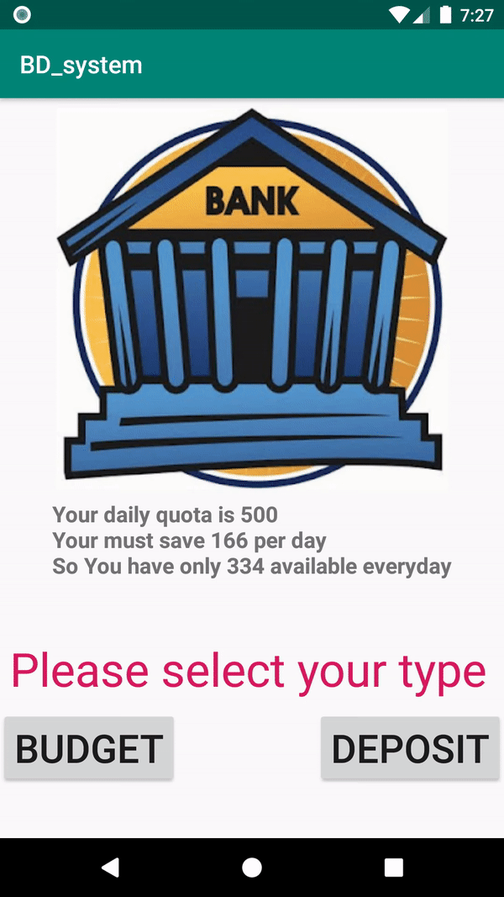

# BDManagement

- 在日常生活中，因為"開源"有限且困難，所以需要"節流"。
- 所以我開發了這個app，用來減少收支繁瑣的計算與登入提醒，畫面簡單易懂好操作。
- Budget: 負責計算出每日可用資金。
- Deposit: 負責計算如果有想購買的物品，每日所需存的金額。

## 組員成員
- P76051195 林德培

## APK
[APK](https://github.com/Tiai/AndroidApp_Project/blob/master/apk/BD_system.apk)

## 程式使用相關技巧
- SharedPreferences
- onclick
- textview
- button
- imageview
- intent switch
- DatePicker

## 程式使用環境
- Nexus 5X API26下測試

## 程式整體使用

## 程式進入畫面

## 預算方面

## 存款方面

## 重開方面

## 圖片參照
[富樂72財商學院-10/4(二)銀行家 vs.投資客－銀行貸款不傳祕技!](https://www.beclass.com/rid=193a1e957ef64ed63a45)
